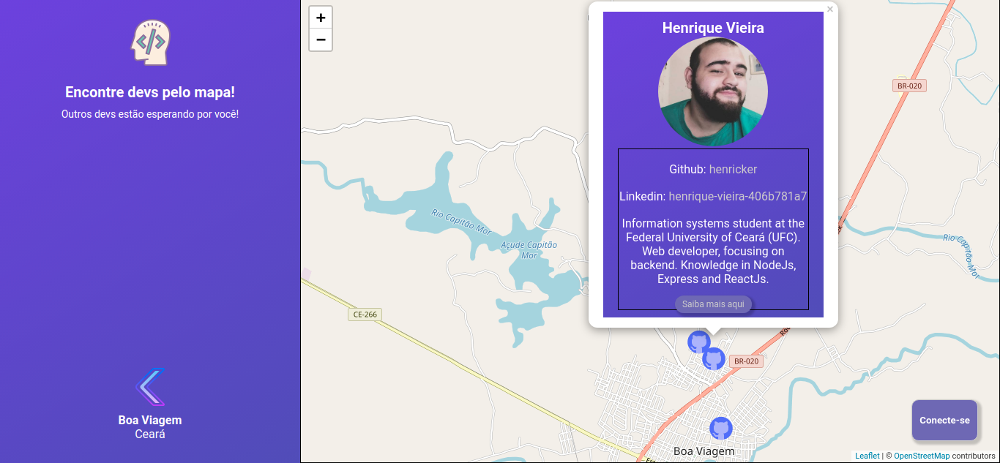
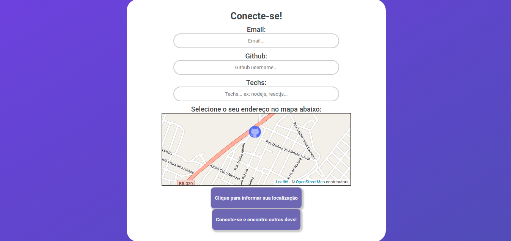

## FindOneDev

-  Instead of programming alone, why not program with other devs on the side? This is the proposal of this project, to unite all the developers of your city!

- Front-End
    - [x] Index-page
    - [x] Map-page
    - [x]  Create-dev-page
    - []  dev-presentation-page
    - [x] connect with backend api

- Back-End
    - [x] model Dev created
    - [x] connect with mongo database
    - [x] routes created
    - [x] config to connect with others servers

## Index page

## Find devs with map

## Create dev page

## Loading...

## Criticism and suggestions?
- Criticism and suggestions are always welcome. If I don't respond in time, I'm sorry, as college has been a rush lately.